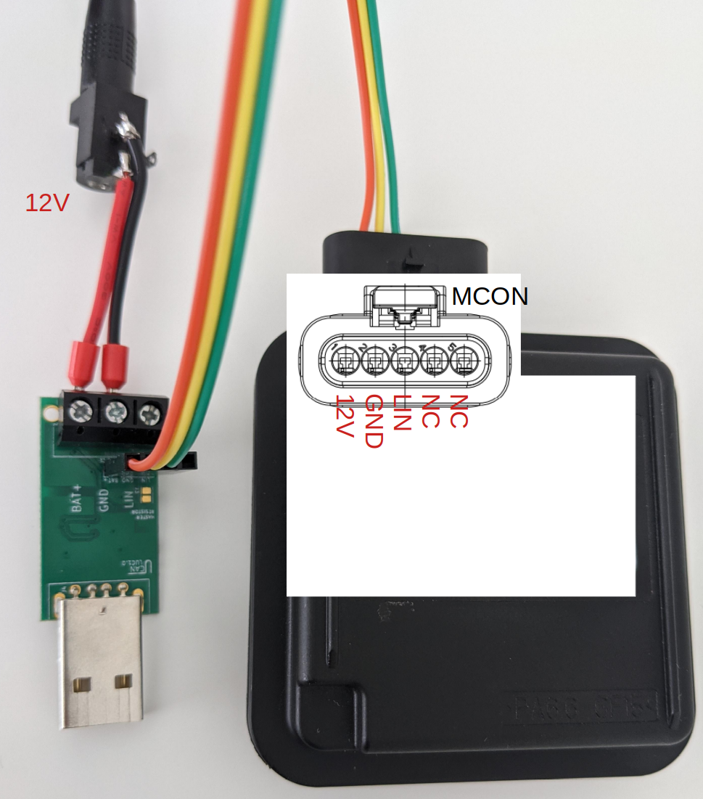
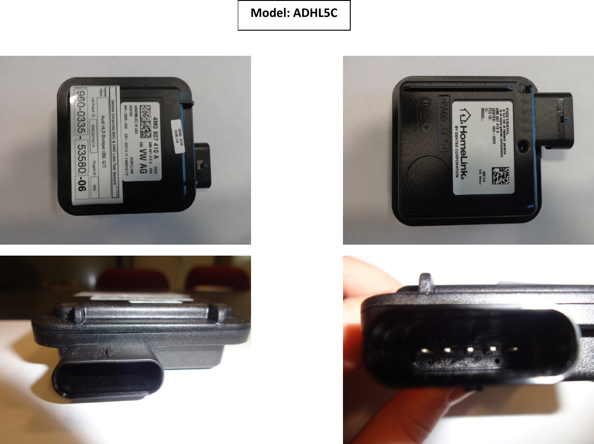
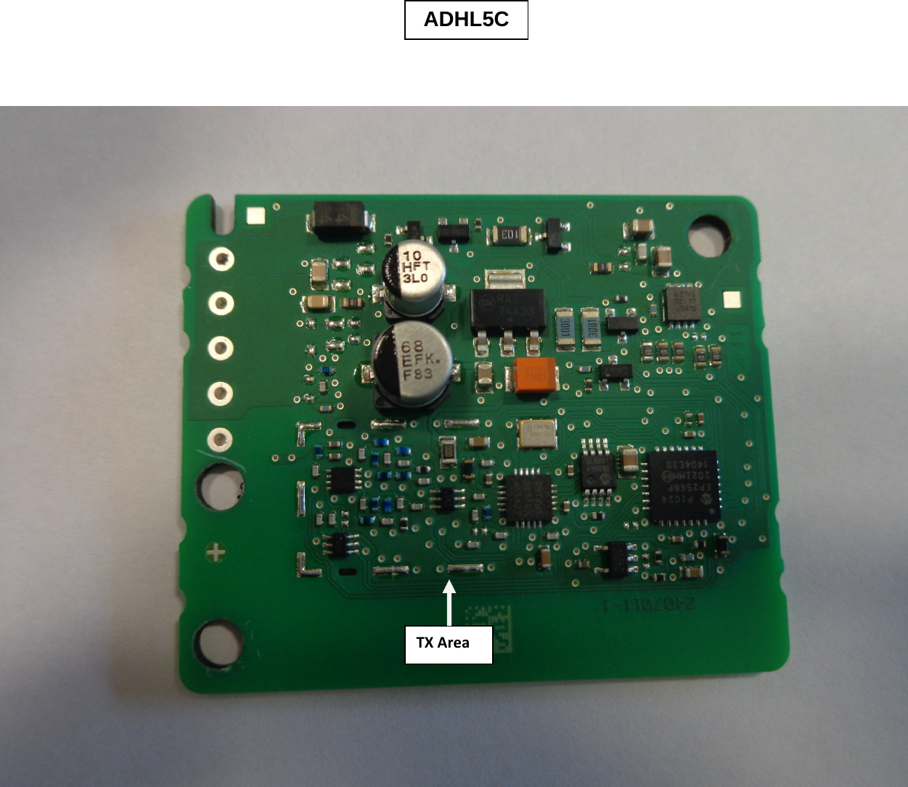
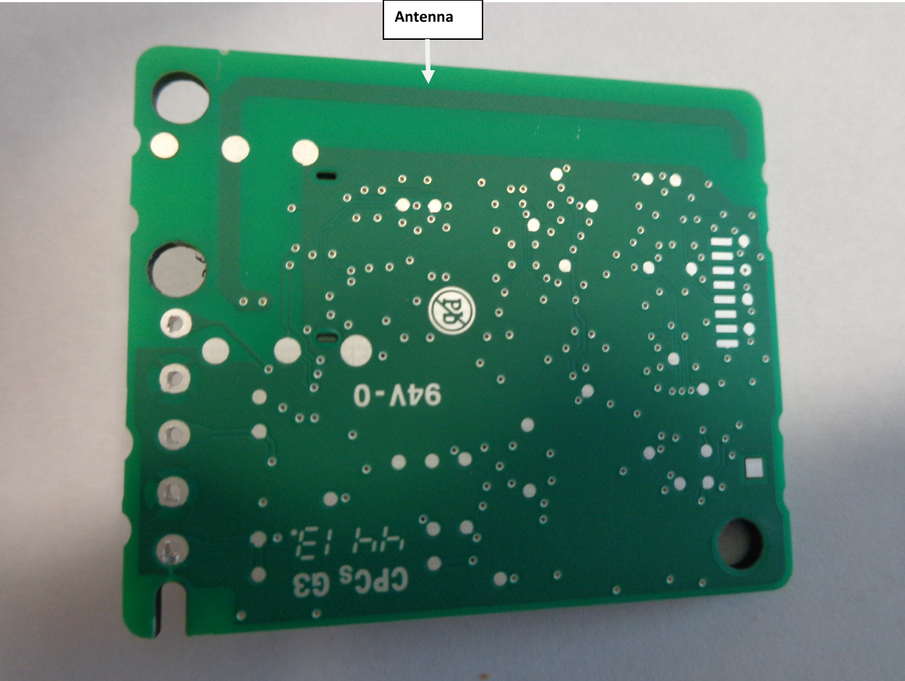
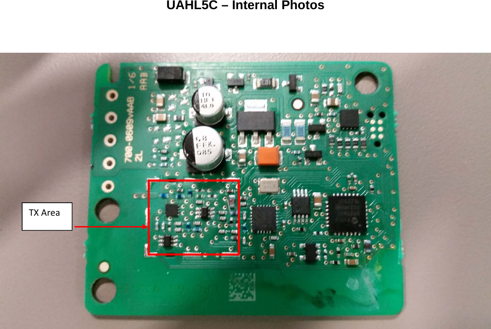
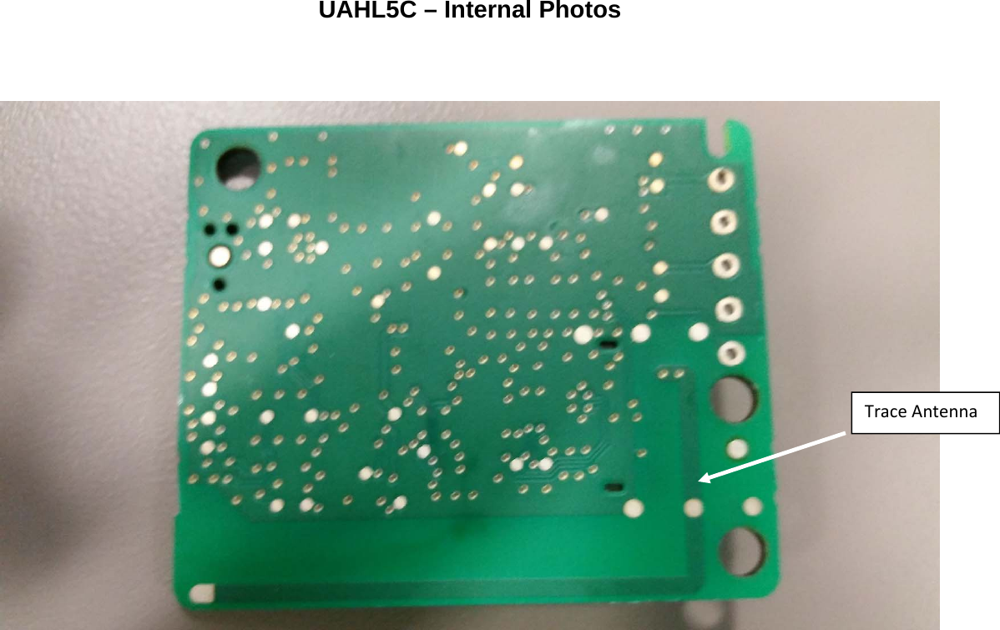
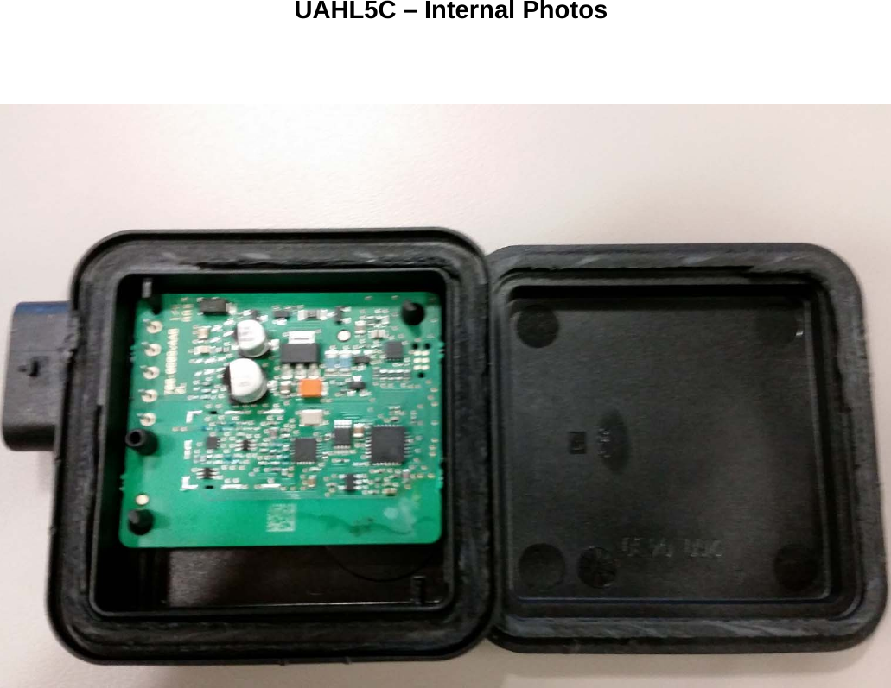
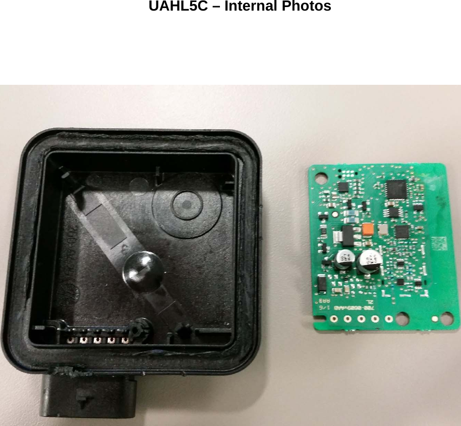

# HomeLink Explorer

HomeLink is a commercial product built into many cars that allows to control a garage door opener typically via a button on the rearview mirror or on the car multi function display.

HomeLink hardware generations 4 (HL4) and 5 (HL5) have modules with LIN interface which are used by VW, Tesla, Porsche and others.

This project only addresses the latest generation (HL5) due to the lack of test hardware for HL4, in particular parts:

* NZLADHL5C
* NZLADHL5D

# Exploring it

## Operate from USB

HL5 talks LIN at 19200 baud.

[Buy](https://ucandevices.github.io/buy.html) a [*LUC*](https://ucandevices.github.io/ulc.html) adapter.

Get a 12V power supply and some standard 2.54mm "dupont" jumpers as they will fit fine the MCON connector of HL5.

Run *commander.py*. Change the */dev/ttyACM0* port in the source code if you need it.

Owh, Linux-Debian/Ubuntu shop here, and you need *sudo apt install python3-tk python3-serial*. Hope you find your way if you have something else.

## Details

### Channels (Memories)

The term channel is used to refer to each of the individual programmable persistent memories on the hardware.

While the current cars only allow to program/use 3 independent channels, HL5 supports (at least) 15 channels.

Cars that control HomeLink with a display could easily use all this channels, but eventually the OEM does not allow them contractually yet for branding reasons.

### Transmission mode

I will use the Tesla nomenclature here. Feel free to report names used by the OEM or by the auto manufacturers

#### Standard mode (Learn)

This is the only mode that is configured by using a existing garage door opener remote.

It will either record the signal code for basic replay transmission, or will instead learn about the manufacturer of the garage door opener in case it is rolling code system.

In case of rolling code HomeLink will know the algorithm and if existing the encryption key of the brand.

The list of supported modes and brands is not readily available.

#### UR mode ("Universal receiver")

Configures the channels to the rolling code Security+ protocol (Chamberlain, LiftMaster, Craftsman, etc).

Modulation is OOK at 433.92 and 867.84MHz.

Each command transmits 5 frames in 0.2s intervals.

The codes used are more or less predictable, they decode to the following data at the receiver:

* Rolling-code: starts at 2, increases in 2 steps. Always independent per channel and reset if channel reconfigured
* Remote-ID: 2590487502 + (ch/3)*59049
* Button: ch%3==0 Middle, ch%3==1 Left, ch%3==2 Right

#### D mode ("Direct mode")

Configures the channels to a rolling code, which I guess so far is Somloq (not SOMloq2).

Modulation is FSK at 434.42 and 868.84MHz.

I will investigate further when I get access to a original Somloq remote.

# TODO

## Find out purpose of two additional pins of HL5

While internal schematics are publicly available for HL4, so far I haven't found one for HL5. This could provide a insight on the use of the unused 2 pins on the MCON connector. On HL4 there is only one unused pin which can be used to flash the car blinker after a successful remote learn.

## Investigate two-way communication

The OEM advertises two-way Communication capability (https://youtu.be/jJ_5LUEV9dc), but I'm not aware if it exists in this hardware/firmware or of any further details.

## Investigate D mode

As mentioned above D mode (Somloq?) is not fully understood.

## Get any more protocol details

Maybe you know of a leaked description of LIN protocol.

# Public photos from FCC

